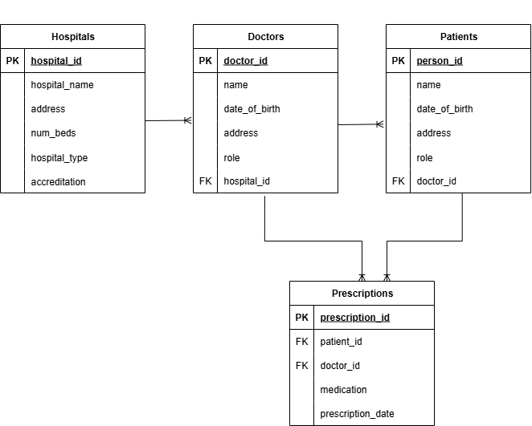

# Hospital Database Management System

## Project Overview

This project implements a  MySQL database system for managing hospital operations, including doctors, patients, hospitals, and prescriptions. 

## Repository Contents

-	hospital_database.sql - Complete database export

-	queries.sql - All 6 functional SQL queries with descriptive names

- CSV data files (hospitals, doctors, patients, prescriptions)

-	README.md - Project documentation (this file)

-	hospital_erd.png - Entity Relationship Diagram

## Data Generation

The dataset was created using the provided CSV files as part of the assignment requirements.

## Database Structure

The database consists of four main tables:

| Table | Records | Description |
|-------|---------|-------------|
| Hospitals | 40 | Hospital details |
| Doctors | 100 | Doctors records |
| Patients | 600 | Patient records and medical assignments |
| Prescriptions | 500 | Medication prescriptions and treatment records |

### Table Schemas

**Hospitals Table**
| Variable | Type | Description |
|----------|------|-------------|
| hospital_id | INT | Unique identifier for each hospital |
| hospital_name | VARCHAR(255) | Name of the hospital |
| address | VARCHAR(255) | Physical location address |
| num_beds | INT | Number of beds (hospital capacity) |
| hospital_type | VARCHAR(50) | Type: Teaching, Community, Research, General, Specialty |
| accreditation_status | VARCHAR(50) | Status: Accredited or Not Accredited |

**Doctors Table**
| Variable | Type | Description |
|----------|------|-------------|
| doctor_id | INT | Unique identifier for each doctor |
| name | VARCHAR(255) | Doctor's full name |
| date_of_birth | DATE | Doctor's date of birth |
| address | TEXT | Contact address |
| role | VARCHAR(50) | Professional role |
| hospital_id | INT | Foreign key linking to Hospitals |

**Patients Table**
| Variable | Type | Description |
|----------|------|-------------|
| person_id | INT | Unique patient identifier |
| name | VARCHAR(255) | Patient's full name |
| date_of_birth | DATE | Patient's date of birth |
| address | TEXT | Contact address |
| role | VARCHAR(50) | Patient role |
| doctor_id | INT | Foreign key linking to assigned Doctor |

**Prescriptions Table**
| Variable | Type | Description |
|----------|------|-------------|
| prescription_id | INT | Unique prescription identifier |
| patient_id | INT | Foreign key linking to Patients |
| doctor_id | INT | Foreign key linking to Doctors |
| medication | VARCHAR(255) | Prescribed medication name |
| prescription_date | DATE | Date prescription was issued |

### Key Relationships
**Primary Keys:**

Each table has a unique primary key for record identification:

- Hospitals: hospital_id

- Doctors: doctor_id

- Patients: person_id  

- Prescriptions: prescription_id

**Foreign Key Relationships:**

-	Doctors → Hospitals (many-to-one)

-	Patients → Doctors (many-to-one)

-	Prescriptions → Patients (many-to-one)

-	Prescriptions → Doctors (many-to-one)
  

## SQL Queries

1.	get_doctors_by_hospital - Retrieve all doctors based at a specific hospital

2.	get_patient_prescriptions - List patient's prescriptions history ordered by date

3.	get_doctor_prescriptions - View all prescriptions issued by a specific doctor

4.	add_new_patient - Register new patients in the system

5. get_most_prescribing_doctor - Identify the most active prescribing doctor

6. get_doctors_at_largest_hospital - Find doctors working at the hospital with maximum capacity

## Entity Relationship Diagram

## How to Use
1. Import `hospital_database.sql` into MySQL
2. Run queries from `queries.sql` as needed
